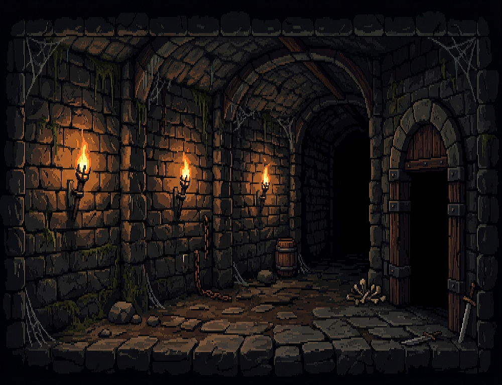
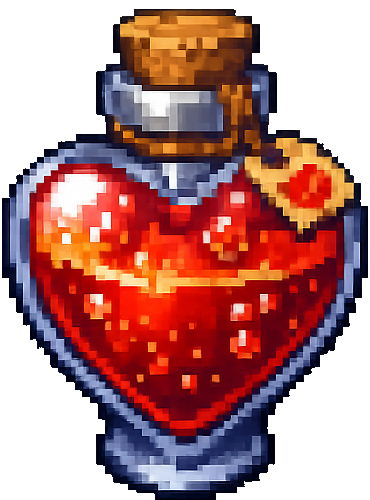
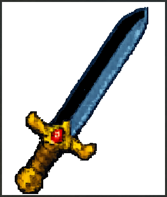
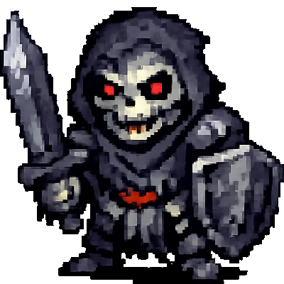

# ⚔️ Les Gueux du Donjon

**Gueux & Donjon** est un jeu de cartes de type *Dungeon Crawler* minimaliste, codé en JavaScript pur (Vanilla JS). Inspiré par les mécaniques célèbres du jeu *Scoundrel*, il vous plonge dans la peau d'un aventurier démuni qui doit traverser un deck de 44 cartes pour sortir vivant d'un donjon.

  

---

## 📜 Le Concept

Le deck représente un donjon. Chaque salle est simulée par 4 cartes. Vous devez en utiliser au moins 3 pour pouvoir passer à la salle suivante. Votre but ? Atteindre la fin du paquet avec au moins 1 point de vie.

### Les Cartes 
| Icône | Type | Description |
| :---: | :--- | :--- |
|  | **Cœurs** | **Potions** : Vous redonnent de la vie. Attention à l'overdose (1 seule par salle) ! |
|  | **Carreaux** | **Armes** : Réduisent les dégâts des monstres. Choisir une nouvelle arme remplace toujours la précédente. |
|  | **Trèfles & Piques** | **Monstres** : Ils vous infligent des dégâts. Combattez-les avec votre arme ou vos poings ! |

---

## 🕹️ Comment jouer ?

1. **La Salle :** 4 cartes sont tirées. Vous devez en cliquer (jouer) au moins 3 pour débloquer le bouton "Salle suivante".
2. **Le Combat :** - Sans arme : Vous perdez autant de PV que la valeur du monstre.
   - Avec arme : Les dégâts sont égaux à `Valeur du monstre - Valeur de l'arme`. 
   - *Règle Cruciale :* Votre arme ne peut tuer un monstre que si sa valeur est **strictement inférieure** à celle du précédent monstre tué avec cette même arme. Sinon, l'arme est inefficace et vous prenez plein tarif !
3. **La Potion :** Les cœurs vous soignent dans la limite de 20 PV. Si vous buvez une deuxième potion dans la même salle, elle ne fait aucun effet.
4. **La Fuite :** Vous pouvez "Fuir la salle" si vous n'avez encore joué aucune carte. Les cartes sont remises sous le deck, mais vous ne pourrez pas fuir la salle suivante !

---

## 🛠️ Installation & Tech Stack

Le projet est développé sans aucun framework (No-Framework JS).

- **Langages :** HTML5, CSS3 (Animations & Flexbox/Grid), JavaScript ES6.
- **Assets :** Pixel Art original (Style Sombre).

Pour lancer le jeu :
1. Clonez le dépôt : `git clone https://github.com/VOTRE_NOM/gueux-et-donjon.git`
2. Ouvrez le fichier `index.html` dans votre navigateur.

---

## 🌟 Crédits

- **Design & Code :** Arrghe
- **Inspiration :** Règles originales du jeu *Scoundrel* (Zach Gage & Kris Overstreet).