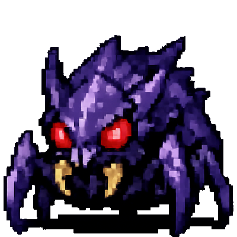

# ⚔️ Gueux & Donjon

**Gueux & Donjon** est un jeu de cartes de type *Dungeon Crawler* minimaliste, codé en JavaScript pur (Vanilla JS). Inspiré par les mécaniques célèbres du jeu *Scoundrel*, il vous plonge dans la peau d'un aventurier démuni qui doit traverser un deck de 44 cartes pour sortir vivant du donjon.

 
*(Remplacez ce lien par une capture de votre jeu une fois en ligne)*

---

## 📜 Le Concept

Le deck représente un donjon. Chaque salle est représentée par 4 cartes. Vous devez en utiliser au moins 3 pour pouvoir passer à la salle suivante. Votre but ? Atteindre la fin du paquet avec au moins 1 point de vie.

### Les Enseignes (Suits)
| Icône | Type | Description |
| :---: | :--- | :--- |
|  | **Cœurs** | **Potions** : Vous redonnent de la vie. Attention à l'overdose (1 seule par salle) ! |
|  | **Carreaux** | **Armes** : Réduisent les dégâts des monstres. Une nouvelle arme remplace toujours la précédente. |
|  | **Trèfles & Piques** | **Monstres** : Ils vous infligent des dégâts. Combattez-les avec votre arme ou vos poings ! |

---
